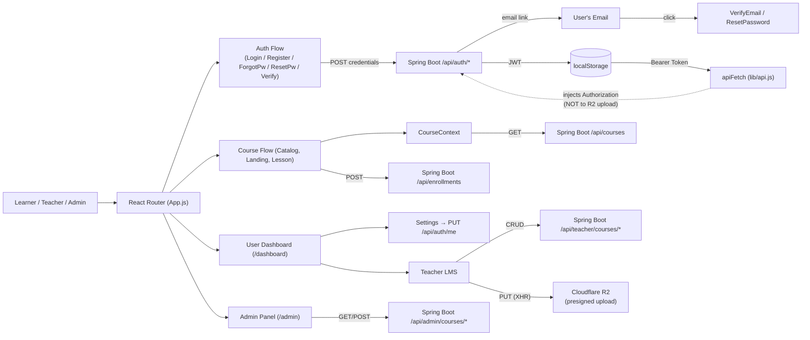

# Project Blueprint: eLearning Frontend (OYAN)

## Snapshot

- Repository: `oyn_front_dep`
- Production: `https://www.oyan.ink`
- Last blueprint update: `2026-04-27`
- Architectural style: React SPA with Context-based catalog caching, Redux session, dual-backend integration
- Build: `npm start` (react-scripts / Webpack)
- Upstream dependencies:
  - Spring Boot backend (`https://api.oyan.ink`): Auth, Courses, Lessons, Teacher LMS, Admin, Progress
  - `json-server` (`localhost:3001`): Legacy domain (Vacancies, Galleries) — still required for legacy routes

## The Essence

OYAN is a Kazakhstan-focused eLearning platform. Current product shape:

1. Public visitors see the landing page and About page.
2. Users register as **Student**, **Teacher**, or **Company** with role-specific fields.
3. Registration triggers **email verification** — user clicks link, auto-logs in via `/api/auth/verify?token=`.
4. **Forgot / Reset Password** flow: user requests reset email, clicks link with token, sets new password.
5. Authenticated students browse the Course Catalog and enroll via inline email form (no forced sign-up).
6. Enrolled students watch lessons with embedded video (Cloudflare R2 presigned URLs, 30-min expiry).
7. **Teachers** have a full LMS dashboard: create courses, add lessons (YouTube/Vimeo URL or direct file upload to R2), build assessments, submit for admin review.
8. **Admin** panel: review pending queue, publish or reject courses with mandatory reason.
9. **Profile editing**: any authenticated user can update `fullName`, `location`, `avatarUrl` via Settings tab.
10. JWT flows through `apiFetch` — automatic token injection, 401/403/429 handling globally.

Primary stack: React 19 · React Router v7 · Redux Toolkit · React Context (catalog) · React Toastify · Vanilla CSS

## High-Level Architecture

### UI / Data Flow



## Route & API Surface

| Route Path | React Component | Backing API | Purpose |
| --- | --- | --- | --- |
| `/login` | `Login.jsx` | `POST /api/auth/login` | Exchange credentials for JWT |
| `/registration` | `Registration.jsx` | `POST /api/auth/register` | Role-selection + create account |
| `/forgot-password` | `ForgotPassword.jsx` | `POST /api/auth/forgot-password` | Request password reset email |
| `/reset-password` | `ResetPassword.jsx` | `POST /api/auth/reset-password` | Set new password via `?token=` |
| `/verify-email` | `VerifyEmail.jsx` | `GET /api/auth/verify?token=` | Auto-login after email verification |
| `/` | `IndexPage.jsx` | static | Landing page |
| `/about` | `AboutPlatform.jsx` | static | Platform marketing page |
| `/courses` | `CourseCatalog.jsx` | `GET /api/courses` | Grid of published courses |
| `/courses/:slug` | `CourseLandingPage.jsx` | `GET /api/courses/{slug}`, `POST /api/enrollments` | Course detail + enrollment |
| `/courses/:courseSlug/lessons/:lessonSlug` | `LessonViewer.jsx` | `GET /api/courses/{cSlug}/lessons/{lSlug}` | Video playback + progress |
| `/dashboard` | `UserProfile.jsx` | `GET /api/auth/me`, `GET /api/enrollments` | Student/Teacher/Admin dashboard |
| `/admin` | `AdminPage.jsx` | `GET /api/admin/courses/*` | Course moderation panel |

### Teacher API (all require ROLE_TEACHER)

| Method | Endpoint | Body / Notes |
| --- | --- | --- |
| `GET` | `/api/teacher/courses` | List own courses |
| `POST` | `/api/teacher/courses` | `{ title, subtitle, description, locale, level, durationHours, price? }` |
| `PUT` | `/api/teacher/courses/:slug` | Same shape; DRAFT or REJECTED only |
| `DELETE` | `/api/teacher/courses/:slug` | DRAFT only |
| `POST` | `/api/teacher/courses/:slug/submit` | → PENDING_REVIEW |
| `POST` | `/api/teacher/courses/:slug/withdraw` | → DRAFT |
| `GET` | `/api/teacher/courses/:slug/lessons` | Ordered lesson list |
| `POST` | `/api/teacher/courses/:slug/lessons` | `{ title, summary, content, videoUrl?, durationMinutes }` |
| `PUT` | `/api/teacher/courses/:slug/lessons/:lSlug` | Same shape |
| `DELETE` | `/api/teacher/courses/:slug/lessons/:lSlug` | 204 |
| `POST` | `/api/teacher/courses/:slug/lessons/:lSlug/video-upload` | `{ fileName, contentType, sizeBytes }` → `{ uploadUrl, objectKey, requiredHeaders, expiresAt }` |
| `POST` | `/api/teacher/courses/:slug/lessons/:lSlug/video-upload/complete` | `{ objectKey }` → 204 |
| `DELETE` | `/api/teacher/courses/:slug/lessons/:lSlug/video` | 204 |

### Profile API

| Method | Endpoint | Body / Notes |
| --- | --- | --- |
| `GET` | `/api/auth/me` | Returns current user (email, fullName, role, location, avatarUrl) |
| `PUT` | `/api/auth/me` | `{ fullName, location, avatarUrl }` — email and role are immutable |

## High-Signal File Map

### Build, Bootstrap, and Config

| Path | Responsibility |
| --- | --- |
| `src/index.js` | React mounting point; wraps app in Redux Provider |
| `src/App.js` | Master router; mounts CourseContext + all routes; hydrates session via `GET /api/auth/me` on load |
| `src/lib/api.js` | `apiFetch` — single HTTP boundary for all Spring Boot calls; injects Bearer, handles 401/403/429/204 |
| `src/index.css` | Global monolith CSS (legacy + shared) |
| `src/Components/Auth.css` | Shared styles for all auth pages (Login, Registration, ForgotPassword, ResetPassword) |

### Auth Flow

| Path | Responsibility |
| --- | --- |
| `src/Components/Login.jsx` | Credentials form → `setUser` dispatch on success |
| `src/Components/Registration.jsx` | Role-selection + account creation; shows "check your email" on 201 without token |
| `src/Components/ForgotPassword.jsx` | Email input → `POST /api/auth/forgot-password` |
| `src/Components/ResetPassword.jsx` | New password form; reads `?token=` from URL → `POST /api/auth/reset-password` |
| `src/Pages/VerifyEmailPage/VerifyEmail.jsx` | Reads `?token=`, calls `/api/auth/verify`, stores JWT, dispatches `setUser` |

### User Dashboard

| Path | Responsibility |
| --- | --- |
| `src/Pages/UserPage/UserProfile.jsx` | Dashboard root; fetches profile + enrollments; routes to teacher or student view by role |
| `src/Pages/UserPage/UserPage.css` | Dashboard layout, sidebar styles (`.sidebar-*`), course cards, LMS teacher panel (`.lms-*`) |
| `src/Pages/UserPage/ui/sidebar.jsx` | Gradient dark sidebar; avatar with initials fallback; `resolveAvatarSrc` for http/relative URLs; icons in nav |
| `src/Pages/UserPage/ui/Settings.jsx` | View/edit toggle; `PUT /api/auth/me` on save; `onSaved` callback updates sidebar profile |
| `src/Pages/UserPage/ui/certificates.jsx` | Student certificates tab |

### Teacher LMS Subsystem

| Path | Responsibility |
| --- | --- |
| `src/Pages/UserPage/ui/TeacherDashboard.jsx` | Tab container: My Courses / Upload Video / Create Assessment |
| `src/Pages/UserPage/ui/TeacherMyCourses.jsx` | Full course CRUD; lesson list with video/assessment tabs; submit/withdraw/delete actions |
| `src/Pages/UserPage/ui/TeacherUploadVideo.jsx` | **Two modes:** (1) YouTube/Vimeo URL, (2) file upload — 4-step R2 presigned flow with XHR progress bar |
| `src/Pages/UserPage/ui/TeacherCreateAssessment.jsx` | Multiple-choice quiz builder; serializes to JSON stored in lesson `content` field |

### Course & Lesson Flow

| Path | Responsibility |
| --- | --- |
| `src/Pages/CoursePage/CourseCatalog.jsx` | Consumes `CourseContext`; renders course cards |
| `src/Pages/CoursePage/CourseLandingPage.jsx` | Course detail; anonymous enrollment form; handles 409 / 429 |
| `src/Pages/LessonPage/LessonViewer.jsx` | Plays lesson video from presigned R2 URL; re-fetches before 30-min expiry; tracks progress |

## Core Business Logic

### 1. Centralized API Client (`apiFetch`)

All Spring Boot calls go through `src/lib/api.js`:
- Reads base URL from `REACT_APP_SPRING_API`
- Injects `Authorization: Bearer <token>` from localStorage
- `401` → clear token + redirect to `/login`
- `403` → throw with `.status = 403`
- `429` → throw rate-limit error
- `204` → return `null`

**Never** add the Bearer header when uploading to Cloudflare R2 — presigned URLs are self-authenticating.

### 2. Video Upload Flow (Cloudflare R2)

```
Teacher picks file (mp4/webm, ≤512MB)
  ↓
POST /lessons           → create lesson → lessonSlug
  ↓
POST /video-upload      → { uploadUrl, objectKey, requiredHeaders: { "Content-Type": "video/mp4" } }
  ↓
XHR PUT {uploadUrl}     → send file with Content-Type from requiredHeaders (not user input)
  (onprogress → update progress bar)
  ↓
POST /video-upload/complete  → { objectKey } → 204
  ↓
lesson.hasVideo = true, lesson.videoUrl = presigned GET URL
```

R2 CORS must allow `PUT` from `https://www.oyan.ink` with `Content-Type` header.

### 3. Profile Edit Flow

```
Settings tab → "Edit Profile" button
  ↓ editing = true (inputs appear)
User edits fullName / location / avatarUrl
  ↓
PUT /api/auth/me  → updated user object
  ↓
dispatch(setUser(updated))     → Redux + localStorage
onSaved(updated)               → UserProfile.setProfile() → sidebar re-renders
```

### 4. Role-Based Dashboard

`UserProfile.jsx` reads `user.role` from Redux:
- `professor` → renders `TeacherDashboard`
- `student` / `admin` / `company` → renders enrolled course list

`user.role` is normalized by `userSlice.normalizeUser`: `TEACHER → professor`, `STUDENT/USER → student`.

### 5. Teacher Course Lifecycle

```
DRAFT → [submit] → PENDING_REVIEW → [admin approve] → PUBLISHED
                                  → [admin reject]  → REJECTED
PENDING_REVIEW → [withdraw] → DRAFT
REJECTED → [edit] → DRAFT
```

- Teachers can only edit/delete in DRAFT or REJECTED
- Cannot submit with zero lessons
- Admin rejection requires a mandatory reason (shown in `TeacherMyCourses`)

### 6. Lesson Type Detection (frontend-side)

The backend stores a single `content` field. The frontend infers lesson type:
- **Video lesson**: `lesson.hasVideo === true` or `lesson.videoUrl` is set
- **Assessment**: `JSON.parse(lesson.content)` succeeds (content is `{ type: "assessment", questions: [...] }`)

### 7. Avatar URL Resolution (`resolveAvatarSrc`)

```js
function resolveAvatarSrc(avatarUrl) {
    if (!avatarUrl) return null;
    return avatarUrl.startsWith("http") ? avatarUrl : `/img/IndexPage/${avatarUrl}`;
}
```

If no avatar: sidebar shows initials (first 2 letters of name) on an indigo gradient background.

## Current State vs. Previous Blueprint

| Previous Risk / Recommendation | Status |
| --- | --- |
| Missing centralized fetch interceptors | **RESOLVED** — `apiFetch` in `src/lib/api.js` |
| Hardcoded upstream URLs | **RESOLVED** — `REACT_APP_SPRING_API` env var |
| App.js mount over-fetching legacy contexts | **RESOLVED** — legacy contexts removed |
| `/dashboard` route missing from App.js | **RESOLVED** — route exists, renders `UserProfile` |
| Settings.jsx was a stub ("coming soon") | **RESOLVED** — full view/edit form with `PUT /api/auth/me` |
| Certificates.jsx was a stub | **RESOLVED** — certificates tab functional |
| TeacherUploadVideo only supported URLs | **RESOLVED** — file upload with R2 presigned flow + progress bar |
| No forgot/reset password flow | **RESOLVED** — `ForgotPassword.jsx` + `ResetPassword.jsx` |
| Sidebar hardcoded "Kazakhstan" location | **RESOLVED** — reads `profile.location` from API |
| Browser tab title was "Photo Cart" | **RESOLVED** — now "OYAN Platform" |
| Migrate legacy json-server to Spring Boot | **STILL PENDING** |
| Course progress tracking in LessonViewer | **IMPLEMENTED** — `PUT current-step` + `POST complete` |

## Remaining Technical Risks

1. **Legacy json-server still load-bearing** — Company and vacancy features depend on `json-server :3001`. Removing or migrating these is the last step to a single-backend architecture.

2. **`PUT /api/auth/me` not yet on backend** — The profile edit endpoint was implemented on the frontend but the backend returns 500. Backend needs to implement the endpoint (see Backend_BluePrint.md).

3. **`POST /api/teacher/courses/:slug/lessons` returns 400** — DTO field name mismatch between frontend (`summary`, `content`) and backend. Backend needs to align its `LessonCreateRequest` DTO.

4. **stub components** — `userCourses.jsx` and `wishlist.jsx` are unused stubs. Safe to delete or implement.

## Short Instruction For Future AI Developers

1. **All Spring Boot API calls must go through `apiFetch`** in `src/lib/api.js`. Never call `fetch` directly for the Spring Boot backend.
2. **R2 uploads are the exception** — use `XMLHttpRequest` with no auth header when uploading to the presigned URL.
3. **Role normalization** — the backend sends `TEACHER`, the frontend stores `professor`. Always compare against the normalized lowercase form.
4. **After `PUT /api/auth/me`** — dispatch `setUser(updated)` AND call `onSaved(updated)` to update the sidebar profile state. Both are needed.
5. **Video URL in LessonViewer is presigned** — expires in 30 minutes. Do not cache or share it. Re-fetch the lesson to get a fresh URL.
6. Use `react-toastify` (`toast.success` / `toast.error`) for all user-facing feedback.
7. The teacher API lives under `/api/teacher/courses/*` and is ownership-gated on the backend. A teacher gets `403` if they try to modify another teacher's course.
