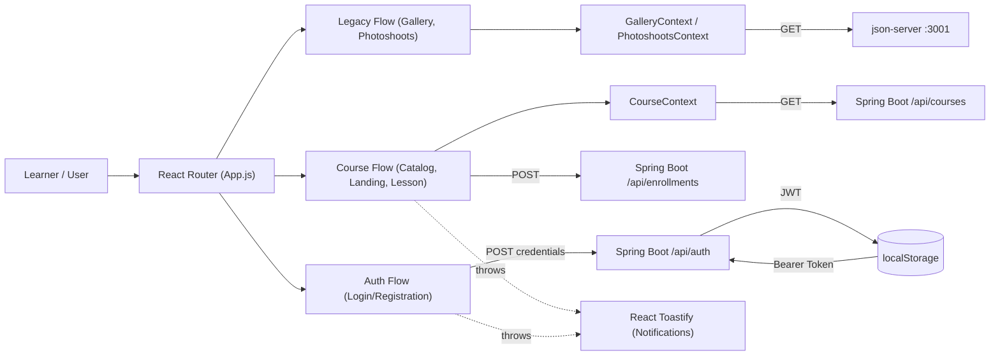
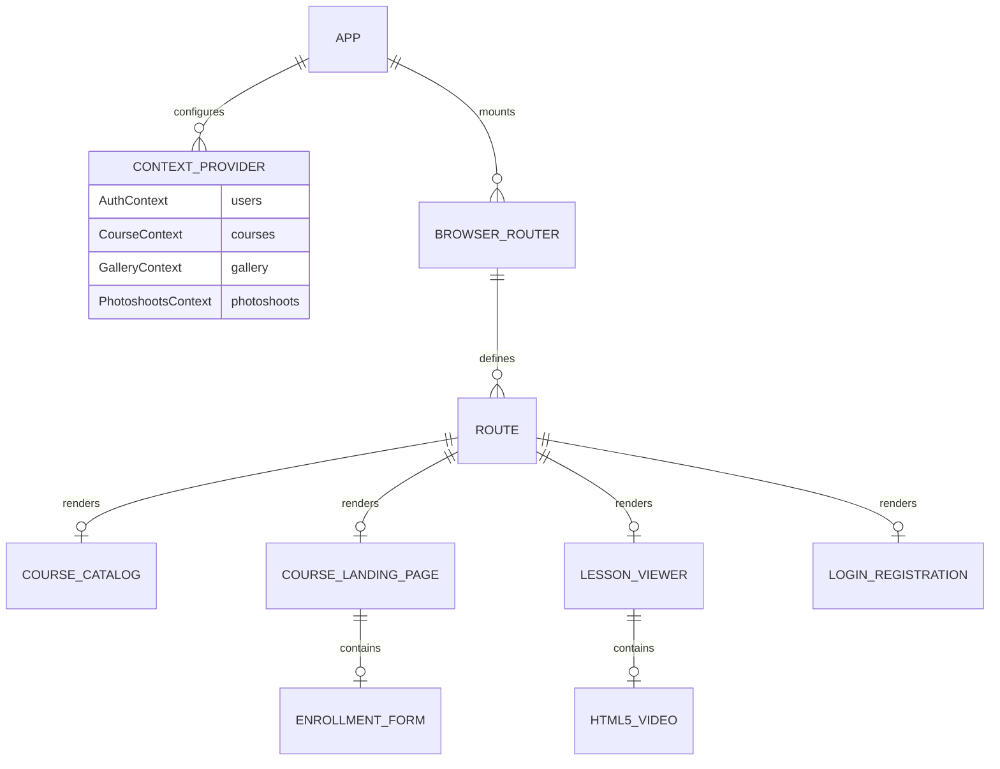

# Project Blueprint: eLearning Frontend (OYN / Jiyuu)

## Snapshot

- Repository: `oyn_front` (internally initialized as `jiyuu`)
- Audit date: `2026-03-22`
- Audit method: code inspection plus repo exploration by a delegated subagent
- Architectural style: React Single Page Application (SPA) with Context-based domain state and dual-backend integration
- Current dev environment: `npm start` (react-scripts) running on standard Webpack dev server
- Upstream Dependencies: 
  - Spring Boot Backend (`http://localhost:7777`): Core eLearning domain (Auth, Courses, Lessons)
  - `json-server` (`http://localhost:3001`): Legacy domain (Gallery, Photoshoots, Vacancies)

## The Essence

This repository is the React frontend component for a combined eLearning and photography/recruitment scheduling platform. It was recently refactored to consume a robust, secure Spring Boot eLearning backend while retaining legacy components powered by a structural `json-server`. 

Current product shape:

1. public visitors can view the legacy Gallery and Index pages,
2. learners can browse a dynamically fetched Course Catalog (`/courses`),
3. learners can open a course landing page mapping to dynamic syllabuses,
4. unauthenticated or authenticated learners can submit interactive Enrollment Forms natively inline,
5. enrolled learners can open lesson viewer pages with embedded HTML5 video playback,
6. users can register or log in with JWT auth (securely exchanging credentials with Spring Boot),
7. legacy roles (`company`, `professor` / photographer) can manage photoshoots and job vacancies.

Primary stack:

- React 19
- React Router DOM v7
- Redux Toolkit (for global UI/Theme state)
- React Context API (for domain model caching)
- React Toastify (for global notification events)
- Vanilla CSS (`index.css`)

This is a pragmatic React monolith where multiple domain contexts, shared components, and feature pages live inside a single client bundle. 

## High-Level Architecture

### Architectural Pattern

The codebase follows a classic feature-level React SPA structure:

- `Pages/` contains domain-bounded route components (e.g., `CoursePage`, `LessonPage`).
- `Components/` contains globally shared UI elements (`Header`, `Footer`, `Login`).
- `redux/` contains the application-wide state slice configurations.
- `App.js` acts as the master composition root, wiring React Context providers around the `BrowserRouter`.

### UI / Data Flow

### Component Hierarchy Model

## Route & API Surface

| Route Path | React Component | Backing API Integrations | Purpose |
| --- | --- | --- | --- |
| `/login` | `Login.jsx` | `POST 7777/api/auth/login`, `GET 7777/api/auth/me` | Exchange credentials for JWT & populate Redux |
| `/registration` | `Registration.jsx` | `POST 7777/api/auth/register` | Create a Spring Boot `PlatformUser` |
| `/courses` | `CourseCatalog.jsx` | `GET 7777/api/courses` | Grid display of available eLearning modules |
| `/courses/:slug` | `CourseLandingPage.jsx` | `GET 7777/api/courses/{slug}`, `POST 7777/api/enrollments` | Course syllabus display and Lead-shell enrollment |
| `/courses/:courseSlug/lessons/:lessonSlug` | `LessonViewer.jsx` | `GET 7777/api/courses/{courseSlug}/lessons/{lessonSlug}` | Video playback and lesson metadata |
| `/`, `/gallery` | `IndexPage.jsx`, `GalleryPage.jsx` | `GET 3001/gallery` | Legacy site landing and photo gallery displays |
| `/photoshoots` | `PhotoshootsPage.jsx` | `GET 3001/photoshoots` | Legacy photographer portfolio views |

## High-Signal File Map

### Build, Bootstrap, and Config
| Path | Responsibility | Why it matters |
| --- | --- | --- |
| `package.json` | Dependencies and Scripts | Defines `react-scripts`, `react-router-dom` v7, and `json-server` dev bindings. |
| `src/index.js` | React mounting point | Wires `react-redux` Provider to the DOM root. |
| `src/App.js` | Master Router and Provider tree | Handles initial global `fetch` calls on mount (populating Contexts) and maps all URL paths. |
| `src/index.css` | Global styling | Monolith vanilla CSS handling classes for `.course-card`, `.lesson-viewer`, legacy heroes. |

### Core Learner Flow
| Path | Responsibility | Why it matters |
| --- | --- | --- |
| `src/Components/Login.jsx` | JWT Auth acquisition | Single point of token generation and Redux `setUser` dispatch. |
| `src/Pages/CoursePage/CourseCatalog.jsx` | Dynamic catalog UI | Connects to `CourseContext` to cleanly map available courses into visual cards. |
| `src/Pages/CoursePage/CourseLandingPage.jsx` | Course detail and Enrollment | Bridges the gap between public viewing and backend enrollment creation. Handles the native email-bound `POST` to `/api/enrollments`. |
| `src/Pages/LessonPage/LessonViewer.jsx` | Media consumption | The MVP endpoint for learners. It dynamically resolves the `videoUrl` payload returned by the Spring Boot backend's lesson schema. |

### Legacy Subsystems
| Path | Responsibility | Why it matters |
| --- | --- | --- |
| `server.json` | Mock DB Schema | Powers the `json-server` for local legacy domain rendering (galleries, vacancies) that Spring Boot ignored. |
| `express.js` | Legacy wrapper | Port 4000 media upload handler utilized by legacy photoshoot addition components. |
| `src/Pages/PhotoshootsPage/` | Legacy Domain | Visualizes and mutates port 3001 resources entirely detached from the eLearning application context. |

## Core Business Logic Explained

### 1. Hybrid Cross-Origin Networking
The frontend is actively communicating with two completely disconnected backends. 
- Standard educational logic (Auth, Courses) queries port `7777`.
- Legacy visual components query port `3001`.
This dictates that developers must ensure *both* backends are running locally simultaneously for the entire `App.js` route tree to function without console fetch errors.

### 2. Context vs. Redux Duties
`Redux` (e.g., `redux/userSlice.js`) is strictly reserved for "session-level" data: active user details and UI toggles (`theme`). 
Conversely, `React Context` (`CourseContext`, `GalleryContext`) acts as a pseudo-cache for Collections of data fetched *once* on `App.js` mount. This saves nested components from refetching catalog lists, though it limits real-time data accuracy.

### 3. Lead-Shell Enrollment Native Flow
Because the Spring Boot backend allows `EnrollmentService` to create anonymous users ("lead-shells") simply via an email address, `CourseLandingPage.jsx` embeds a standalone inline email form. This completely bypasses the need to force users through `/registration` just to express interest in a course, prioritizing a low-friction UI funnel.

### 4. JWT Client-Side Delegation
Unlike cookie-based sessions, the frontend manually stores the JWT in `localStorage` inside `Login.jsx`. Any authenticated calls (like `/api/auth/me`) manually inject this token via the `Authorization: Bearer` header.

## Infrastructure and Environment

### Delivery and Tooling
Current local environment behavior:
- `npm start` fires up webpack on port `3000`.
- The `json-server` must be started in a separate terminal via an explicit CLI call if legacy gallery components are needed.
- No CI/CD pipelines, Dockerfiles, or `.env` templates exist in the repository.

Takeaway:
- The app expects a developer to cleanly orchestrate standard local NodeJS workflows, and relies heavily on hardcoded API URLs.

## Current State Verified From Source

The following state changes are verified and active:
- The legacy, vulnerable `json-server` client-side password hashing code was eradicated from `Login.jsx`.
- `CourseLandingPage.jsx`, `CourseCatalog.jsx`, and `LessonViewer.jsx` exist and correctly map to the Spring Boot DTO patterns.
- `react-toastify` is heavily integrated, proving successful error and success toast notifications across Auth and Enrollment boundaries.

## Documentation Drift and Risk Areas

### Notable technical risks

1. **Hardcoded Upstream Origins**
   URLs like `http://localhost:7777` and `http://localhost:3001` are hardcoded in at least 5 different files. Moving from dev to staging/production requires a substantial manual refactor or `.env` setup.
2. **Missing Centralized Axios/Fetch Interceptors**
   Because `fetch` is called directly per component, future authenticated routes (e.g., watching a restricted lesson) will require repetitive boilerplate to fetch `localStorage.getItem('token')`.
3. **App.js Mount Over-Fetching**
   `App.js` triggers simultaneous `fetch` operations on mount. If a user only wants to log in, the app automatically pulls down all legacy photo galleries regardless, wasting bandwidth.

## Recommended Next Engineering Steps

1. Configure a `.env` file (e.g. `REACT_APP_SPRING_API=http://localhost:7777`) and refactor all API calls to utilize it.
2. Create an `apiClient.js` service utility that wraps `fetch` or `axios`, automatically appending the Bearer token for seamless scaling of protected routes.
3. Migrate `App.js` context fetching into route-level loaders (leveraging React Router v7 paradigms) so data is only fetched when that specific domain is visited.
4. Finalize the product direction by either migrating the legacy `server.json` datasets into Spring Boot or cleanly ripping them out of the frontend to reduce bloat.

## Short Instruction For Future AI Developers

Use the React component trees and `App.js` routes as the source of truth.

Before changing behavior:

1. check `App.js` to see if the data you need is already cached globally in a Context provider.
2. check `Login.jsx` to understand the standard pattern for extracting and storing the JWT token.
3. verify you are communicating with the correct backend (Port `7777` for eLearning, `3001` for legacy).
4. use `react-toastify` for all user-facing success/error feedback loops.

If you only remember one mental model, remember this:
- This is a functional React SPA actively straddling two decoupled backends, utilizing Context for core domain models and Redux for the active session state.
